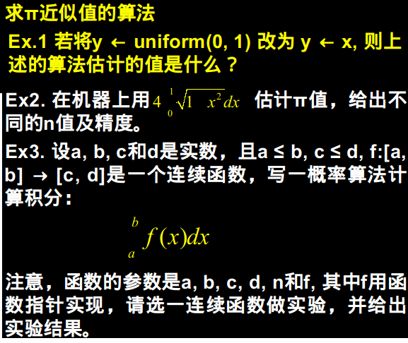
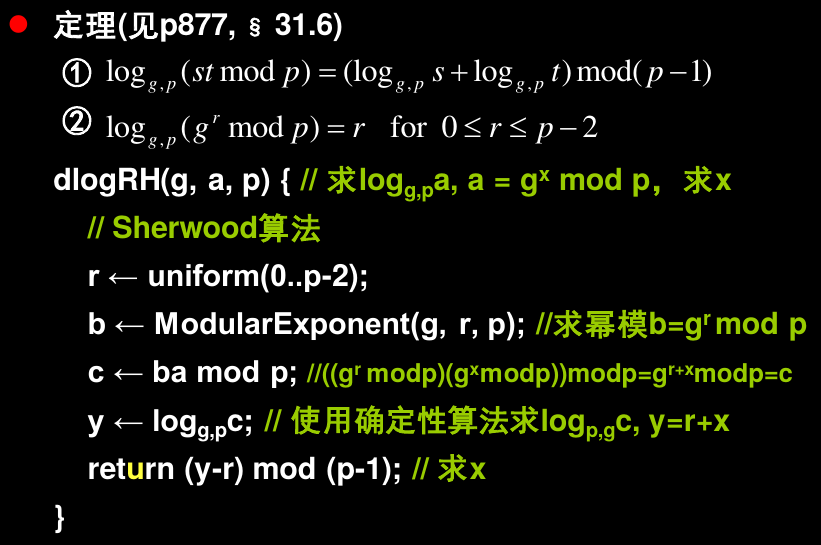
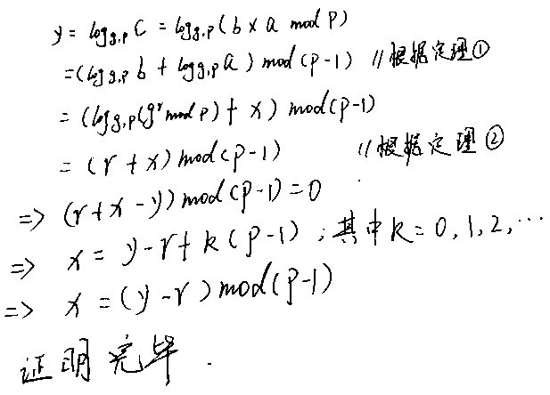

# 第一次题目



Ex.1 若将 y=uniform(0,1)修改为y=x，则上述算法的估计值是：2×√2

代码段：
```c
#include <stdio.h>
#include <stdlib.h>
#include <time.h>

int isSetSeed = 0;

double uniform0_1(){
    if(!isSetSeed){
        isSetSeed = 1;
        srandom(time(NULL));
    }
    return (double)random()/RAND_MAX;
}

double dart(long n){
    int k = 0;
    for(int i=0; i<n; ++i){
        double x = uniform0_1();
        double y = x;
        if(x*x+y*y<=1)++k;
    }
    return 4*(double)k/n;
}

int main(){
    printf("10  million:%lf\n",dart(10000000));
    printf("100 million:%lf\n",dart(100000000));
    printf("1   billion:%lf\n",dart(1000000000));
    return 0;
}
```

实验结果：
```
10  million:2.827990
100 million:2.828244
1   billion:2.828429
```
实际值为：2.8284271247461900976

Ex.2 
代码段：
```c
#include <stdio.h>
#include <stdlib.h>
#include <time.h>
#include <math.h>

int isSetSeed = 0;

double uniform0_1(){
    if(!isSetSeed){
        isSetSeed = 1;
        srandom(time(NULL));
    }
    return (double)random()/RAND_MAX;
}

double calcPi(long n){
    int k = 0;
    for(long i=0; i<n; ++i){
        double x = uniform0_1();
        double y = uniform0_1();
        if(sqrt(1-x*x) >= y){
            ++k;
        }
    }
    return (double)k*4/n;
}

int main(){
	printf("10  million:%lf\n",calcPi(10000000));
    printf("100 million:%lf\n",calcPi(100000000));
    printf("1   billion:%lf\n",calcPi(1000000000));
    return 0;
}
```
实验结果：
```
10  million:3.141745
100 million:3.141441
1   billion:3.141541
```

Ex3.代码段：
```c
#include <stdio.h>
#include <stdlib.h>
#include <time.h>

int isSetSeed = 0;

double uniform(double min, double max){
    if(!isSetSeed){
        isSetSeed = 1;
        srandom(time(NULL));
    }
    return min+(max-min)*((double)random()/RAND_MAX);
}

//待积分的函数
double f(double x){
    return 1-x*x;
}

//f:带积分函数
//[a,b]:积分区间
//[c,d]:积分区间对应的值域
//n:投标次数
double integrate(double (*f)(double), double a, double b,
        double c, double d,long n){
    int k = 0;
    for(long i=0; i<n; ++i){
        double x = uniform(a,b);
        double y = uniform(c,d);
        double fx = f(x);
        if(fx>y){
            ++k;
        }
    }

    return ((double)k/n*(d-c)+c)*(b-a);
}

int main(){
    printf("10 million:%lf\n",integrate(f,0,2,-3,1,10000000));
    return 0;
}
```
结果：
```
10 million:-0.665241
```

## Ex P36

如下是估计一个集合的势的代码：
```c
SetCount (X) {
		k ← 0; S ← Ф;
		a ← uniform(X);
		do {
			k++;
			S ← S∪{a}; a ← uniform(X);
		} while (a ∉ S)
		return 2k2/π
	}

```
用上述算法，估计整数子集1~n的大小，并分析n对估计值的影响。

用该算法估计C语言中ramdom()函数产生的最大值。

```c++
#include <stdio.h>
#include <time.h>
#include <stdlib.h>
#include <math.h>
#include <vector>
#include <algorithm>

#define PI 3.1415926

using namespace std;

long int uniform(){
    return random();
}


double SetCount(){
    double k = 0;
    vector<int> S;
    long int a = uniform();
    bool isChecked = false;
    do{
        k++;
        S.push_back(a);
        a = uniform();
        vector<int>::iterator iter = std::find(S.begin(),S.end(),a);
        if(iter!=S.end()){
            isChecked = true;
        }
    }while(!isChecked);
    return 2*k*k/PI;
}

int main(){
    srandom(time(NULL));
    printf("RAND_MAX:%d\n",RAND_MAX);
    printf("Evaluate:%.0lf\n",SetCount());
    return 0;
}
```
实验结果：
#### 第一次：
```
RAND_MAX:2147483647
Evaluate:37951351
```

#### 第二次：
```
RAND_MAX:2147483647
Evaluate:2915055392
```

#### 第三次：
```
RAND_MAX:2147483647
Evaluate:3683311513
```

#### 第四次：
```
RAND_MAX:2147483647
Evaluate:4683398122
```

通过多次计算求平均值：

#### 100次后求平均值：
```
RAND_MAX:2147483647
Evaluate:2720385488
```
误差：26.677%

#### 1000次后求平均值后：
```
RAND_MAX:2147483647
Evaluate:2666816931
```
误差：24.183%

误差随着次数的增加，会减小，但还是在20%以上；

## Ex P54


分析dlogRH的工作原理,指出该算法中相应的u(u为使用shewood算法进行随机化的函数)和v(v为将结果转换回去的函数)

解答：


其中：
```
b ← ModularExponent(g, r, p);
c ← ba mod p;
为u函数

(y-r) mod (p-1); 
为v函数
```

## Ex67 搜索有序表

设x≥val[i]且x在表中,则从位置i开始查找x的算法为
```
Search(x, i) { //仍可改进
    while x > val[i] do
    i ← ptr[i];
    return i;
}

A(x) {
    return Search(x, head);
}

B(x) { //设x在val[1..n]中
    i ← head;
    max ← val[i]; // max初值是表val中最小值
    for j ← 1 to ⌊√n⌋{ 
        y ← val[ j ];
        // 的最大整数y相应的下标
        if max < y ≤x then {
            i ← j;
            max ← y;
        } //endif
    } // endfor
    return Search(x, i); // 从y开始继续搜索
}


D(x) {
    i ← uniform(1..n);
    y ← val[i];
    case {
    x < y:return Search(x, head); // case1
    x > y:return Search(x, ptr[i]); //case2
    otherwise: return i; // case3, x = y
    }
}
```
**Ex. 写一Sherwood算法C,与算法A, B, D比较,
给出实验结果。**

代码构建：

一个用于创建静态链表的类：
```py
class StaticChain:
    def __init__(self, size):
        self.size = size;
        self.val = [0 for i in range(size)];
        self.ptr = [i+1 for i in range(size)];
        self.ptr[size-1] = -1;
        #使用了的空间的头指针
        self.head = -1;
        #未使用的空间的头指针
        self.uhead = 0;
        self.len = 0;

    def len(self):
        return self.len;

    def assignPos(self):
        if(self.uhead==-1):
            return -1;
        p = self.uhead;
        self.uhead = self.ptr[self.uhead];
        return p;

    def reclaimPos(self,p):
        self.ptr[p] = self.uhead;
        self.uhead = p;

    def insert(self, v):
        newPos = self.assignPos();
        if(newPos==-1):
            print("chain has full");
            return self;
        if(self.head==-1 or v <= self.val[self.head]):
            self.ptr[newPos] = self.head;
            self.head = newPos;
            self.val[self.head] = v;
            return;
        p = self.head;
        while(self.ptr[p]!=-1 and self.val[self.ptr[p]]<v):
            p = self.ptr[p];
        self.ptr[newPos] = self.ptr[p];
        self.ptr[p] = newPos;
        self.val[newPos] = v;
        return self;

    def pushFront(self,v):
        newPos = self.assignPos();
        if(newPos==-1):
            print("chain has full");
            return;
        self.ptr[newPos] = self.head;
        self.head = newPos;
        self.val[self.head] = v;

    def popFront(self):
        if(self.head==-1):
            print("chain has empty");
            return;
        v = self.val[self.head];
        tpos = self.head;
        self.head = self.ptr[self.head];
        self.reclaimPos(tpos);

    def front(self):
        if(self.head==-1):
            print("chain has empty");
            return;
        return self.val[self.head];

    def showChain(self):
        p = self.head;
        while(p!=-1):
            print(self.val[p],end=",");
            p = self.ptr[p];
        print();
```
A、B、C、D 4种搜索方法的定义与测试：
```py
from datetime import datetime
import random
import math

chainLen = 10000;
sc = StaticChain(chainLen);

for i in range(chainLen):
    sc.insert(random.randint(0,10*chainLen));

def search(x, i):
    while i!=-1 and x > sc.val[i]:
        i = sc.ptr[i];
    return i;

def A(x):
    return search(x,sc.head);

def B(x):
    i = sc.head;
    maxv = sc.val[i];
    tp = int(math.sqrt(chainLen));
    for j in range(0,tp):
        y = sc.val[j];
        if maxv < y and y <= x :
            i = j
            maxv = y;
    return search(x, i);

def C(x):
    r = random.randint(1,chainLen-1);
    i = sc.head;
    maxv = sc.val[i];
    tp = int(math.sqrt(chainLen));
    for j in range(r,r+tp):
        if(j >= chainLen):
            break;
        y = sc.val[j];
        if maxv < y and y <= x :
            i = j;
            maxv = y;
    return search(x, i);

def D(x):
    i = random.randint(0,chainLen-1);
    y = sc.val[i];
    if x < y:
        return search(x, sc.head);
    elif x > y:
        return search(x,sc.ptr[i]);
    else:
        return i;

testv = sc.val[random.randint(0,chainLen-1)];
print("testv : %d" %testv);

def testFunc(func):
    print("----test %s----" %func.__name__);
    t1 = datetime.now();
    index = func(testv);
    delta = datetime.now()-t1;
    print("index:%d, delta:%s, value:%d" %(index,str(delta),sc.val[index]));
    print();

testFunc(A);
testFunc(B);
testFunc(C);
testFunc(D);
```

测试结果1：
```
testv : 75776
----test A----
index:7246, delta:0:00:00.001377, value:75776

----test B----
index:7246, delta:0:00:00.000085, value:75776

----test C----
index:7246, delta:0:00:00.000077, value:75776

----test D----
index:7246, delta:0:00:00.000827, value:75776
```
测试结果2：
```
testv : 30652
----test A----
index:9876, delta:0:00:00.000597, value:30652

----test B----
index:9876, delta:0:00:00.000040, value:30652

----test C----
index:9876, delta:0:00:00.000059, value:30652

----test D----
index:9876, delta:0:00:00.000586, value:30652
```
**总结**：A、D的运行时间大致相等，B、C的运行时间大致相等,B、C的运行效率要高于A、D的运行效率；


